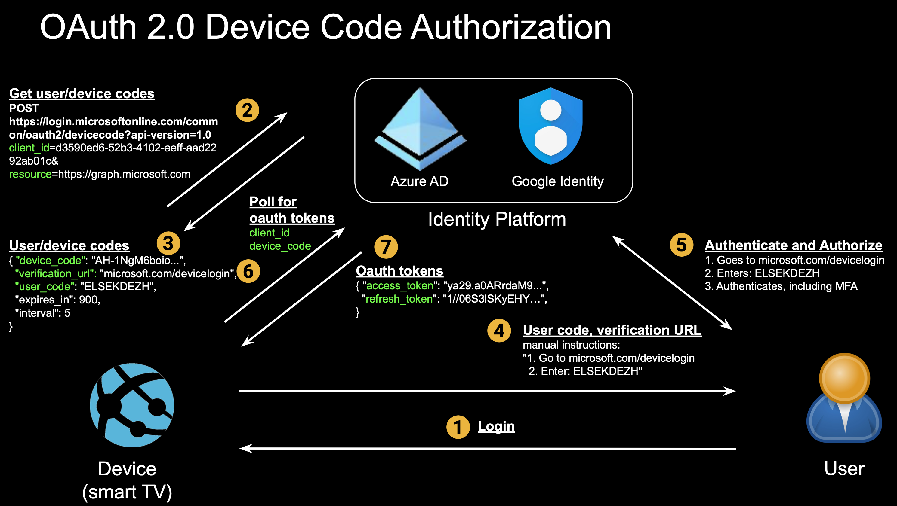

# Description

    This project provides POC code to explore [OAuth 2.0](https://datatracker.ietf.org/doc/html/rfc6749)
    authorization flows and how they can be abused in phishing attacks.
    
    Specifically, we demonstrate a phishing attack using the device authorization grant
    on Microsoft and intend to add additional flows as we go. An implementation of this 
    is written in generic Powershell and can be run on any supported platform. Most cmdlet
    calls are simple REST API calls and should be translateable to any language.

# Running the Code
1. [Install Powershell 7.x](https://docs.microsoft.com/en-us/powershell/scripting/install/installing-powershell?view=powershell-7.1)
2. Setup Microsoft Environment (for the victim)
    - Within Azure AD, create user account
    - Enable Office 365 and ensure user has access to Outlook
    - Ensure user has read access to an Azure subscription and resources
    - **NOTE: the attacker does not need a Microsoft account or environment**
3. Configure demo_cfg.json
    - Set SMTP settings if you want to have the demo code send an email phish
    - Keep other config settings as is (page=true, interactive=true, verbose=1, etc.)
4. Run
    - command-line: `Powershell.exe|pwsh demo_msft.ps1 -config demo_cfg.json`
    - Step #0: user and device codes generated
    - Step #1: phish email sent (to user/victim set in demo_cfg.json)
    - Step #2: will loop waiting for user/victim to authenticate/authorize
    - In browser, <log in as user/victim to login.microsoft.com, check Outlook, follow phishing email link, authenticate)
    - Step #3: retrieve user''s oauth access tokens
    - Step #4: use access token to list users in Azure AD
    - Step #5: retrieve user''s email
    - Step #6: move laterally and use refresh token to get new access token for Azure
    - Step #7: will list resources within Azure subscriptions that the user/victim has access to

# Directories / Files
    device_code/pwsh/
        demo_msft.ps1       - main Powershell file. Usage: powershell|pwsh -h
        demo_cfg.json       - required config file
        demo_email.txt      - email template if sending phish email

# OAuth Flows

## Device Authorization Grant (device code flow)
 

# References

1. Evolving Phishing Attacks
    - [A Big Catch: Cloud Phishing from Google App Engine and Azure App Service](https://www.netskope.com/blog/a-big-catch-cloud-phishing-from-google-app-engine-and-azure-app-service)
    - [Microsoft Seizes Malicious Domains Used in Mass Office 365 Attacks](https://threatpost.com/microsoft-seizes-domains-office-365-phishing-scam/157261/)
    - [Phishing Attack Hijacks Office 365 Accounts Using OAuth Apps](https://www.bleepingcomputer.com/news/security/phishing-attack-hijacks-office-365-accounts-using-oauth-apps/)
    - [Office 365 Phishing Attack Leverages Real-Time Active Directory Validation](https://threatpost.com/office-365-phishing-attack-leverages-real-time-active-directory-validation/159188/)
    - [Demonstration - Illicit Consent Grant Attack in Azure AD](https://www.nixu.com/blog/demonstration-illicit-consent-grant-attack-azure-ad-office-365)
https://securecloud.blog/2018/10/02/demonstration-illicit-consent-grant-attack-in-azure-ad-office-365/)
    - [Detection and Mitigation of Illicit Consent Grant Attacks in Azure AD](https://www.cloud-architekt.net/detection-and-mitigation-consent-grant-attacks-azuread/)
    - [HelSec Azure AD write-up: Phishing on Steroids with Azure AD Consent Extractor](https://securecloud.blog/2019/12/17/helsec-azure-ad-write-up-phishing-on-steroids-with-azure-ad-consent-extractor/)
    - [Pawn Storm Abuses OAuth In Social Engineering Attack](https://www.trendmicro.com/en_us/research/17/d/pawn-storm-abuses-open-authentication-advanced-social-engineering-attacks.html)

2. OAuth Device Code Flow
    - [OAuth 2.0 RFC](https://tools.ietf.org/html/rfc6749)
    - [OAuth 2.0 Device Authorization Grant RFC](https://datatracker.ietf.org/doc/html/rfc8628)
    - [OAuth 2.0 for TV and Limited-Input Device Applications](https://developers.google.com/identity/protocols/oauth2/limited-input-device)
    - [OAuth 2.0 Scopes for Google APIs](https://developers.google.com/identity/protocols/oauth2/scopes)
    - [Introducing a new phishing technique for compromising Office 365 accounts](https://o365blog.com/post/phishing/#oauth-consent)
    - [Office Device Code Phishing](https://gist.github.com/Mr-Un1k0d3r/afef5a80cb72dfeaa78d14465fb0d333)

3. Additional OAuth Research Areas
    - [Poor OAuth implementation leaves millions at risk of stolen data](https://searchsecurity.techtarget.com/news/450402565/Poor-OAuth-implementation-leaves-millions-at-risk-of-stolen-data)
    - [How did a full access OAuth token get issued to the Pokémon GO app?](https://searchsecurity.techtarget.com/answer/How-did-a-full-access-OAuth-token-get-issued-to-the-Pokemon-GO-app)

